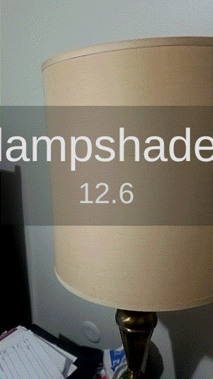

# ML Classification



This is a library for classifying images in Unity Engine using NatML. The following ML models are included:
- [EfficientNet Lite 4](https://github.com/onnx/models/tree/master/vision/classification/efficientnet-lite4)
- [MobileNet v2](https://github.com/onnx/models/tree/master/vision/classification/mobilenet)
- [ShuffleNet v2](https://github.com/onnx/models/tree/master/vision/classification/shufflenet)
- [SqueezeNet 1.1](https://github.com/onnx/models/tree/master/vision/classification/squeezenet)

## Classifying an Image
First, assign one of the included models (in the `ML` folder) to an `MLModelData` field in your script:
```csharp
using NatSuite.ML;
using NatSuite.ML.Vision;

public class Classifier : MonoBehaviour {

    public MLModelData modelData; // Assign this in the Inspector
}
```

Then create a classification predictor:
```csharp
void Start () {
    var model = modelData.Deserialize();
    var predictor = new MLClassificationPredictor(model, modelData.labels);
}
```

Finally, classify an image:
```csharp
Texture2D image = ...;
var (label, confidence) = predictor.Predict(image);
```

You cal also classify a `WebCamTexture` or [create an image feature directly from pixel data](https://docs.natsuite.io/natml/api/mlfeature/mlimagefeature).

## Requirements
- Unity 2019.2+
- NatML 1.0+

## Supported Platforms
- Android 7.0 Nougat or newer (API level 24+)
- iOS 13+
- macOS 10.15+
- Windows 10 64-bit

## Quick Tips
- See the [NatML documentation](https://docs.natsuite.io/natml).
- Join the [NatSuite community on Discord](https://discord.gg/y5vwgXkz2f).
- See [NatML on Unity Forums](https://forum.unity.com/threads/open-beta-natml-machine-learning-runtime.1109339/).
- Contact us at [hi@natsuite.io](mailto:hi@natsuite.io).